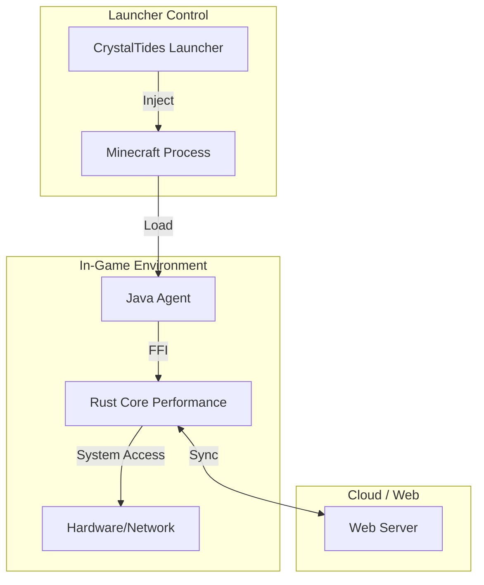

# 🌉 CrystalTides Game Bridge

> **The native heart of the player's client.**


## 💎 Overview

El **CrystalTides Game Bridge** (o Game Agent) es un componente cliente experimental diseñado para integraciones nativas profundas. A diferencia del bridge del servidor, este agente vive dentro del proceso de Minecraft del jugador, permitiendo capacidades que van más allá de lo que un mod estándar puede ofrecer.

---

## 🌟 Core Features

- 🖥️ **Custom HUDs & Overlays**: Renderizado directo sobre la interfaz de Minecraft para información de misiones, staff y eventos.
- 📡 **Native Telemetry**: Recolección de métricas de rendimiento y red desde la perspectiva del jugador.
- 🛠️ **JVM Injection**: Se engancha al arranque del juego como un `-javaagent` para optimizaciones dinámicas.
- ⚡ **Rust-Native Performance**: Núcleo escrito en Rust para tareas pesadas sin afectar el GC de Java.
- 🎮 **Premium Interactions**: Futuras capacidades de interacción enriquecida exclusivas para usuarios del launcher oficial.

---

## 🏗️ Architecture

El Game Bridge opera como un puente entre el ecosistema nativo de CrystalTides y el runtime de Java de Minecraft:



> [!NOTE]
> **Estado de Desarrollo**: Este es un componente **experimental**. No es obligatorio para entrar al servidor, pero habilita características premium en el launcher oficial.

---

## 🛠️ Tech Stack

| Componente | Tecnología | Propósito |
| :--- | :--- | :--- |
| **Injection** | Java Instrumentation API | Enganche en el bytecode de Minecraft |
| **Logic Core** | [Rust](https://www.rust-lang.org) | Cómputo de alto rendimiento y seguridad |
| **Communication** | JNI / Dart FFI | Interoperabilidad Java <-> Rust |
| **UI Rendering** | OpenGL / Dear ImGui | Overlays nativos sobre el juego |

---

## 🚀 Desarrollo & Build

### 🛠️ Entorno Local

1.  **Instalar dependencias nativas:**
    Asegúrate de tener `cargo` (Rust) y un `JDK 17+` instalado.
2.  **Compilar el puente:**
    ```bash
    npm run build
    ```
    *Este comando orquesta la compilación del binario en Rust y el empaquetado del JAR del agente.*

---

## 🗺️ Roadmap Experimental

- [ ] **Rich In-Game Menu**: Menú de configuración del launcher accesible directamente desde el juego (`Shift + Tab`).
- [ ] **Instant Replay integration**: Captura de clips de gameplay delegada al núcleo de Rust.
- [ ] **SpacetimeDB Telemetry**: Envío de métricas de red en tiempo real para optimizar el routing de los jugadores.

---

> [!WARNING]
> **Uso avanzado**: La inyección de agentes Java puede ser detectada por algunos anti-cheats externos. Este componente está diseñado para ser usado exclusivamente dentro del ecosistema **CrystalTides**.

---

> [!NOTE]
> Este repositorio forma parte del monorepo de **CrystalTides**. Para más información sobre el ecosistema completo, visita el [README Principal](../../projects/README.md).
